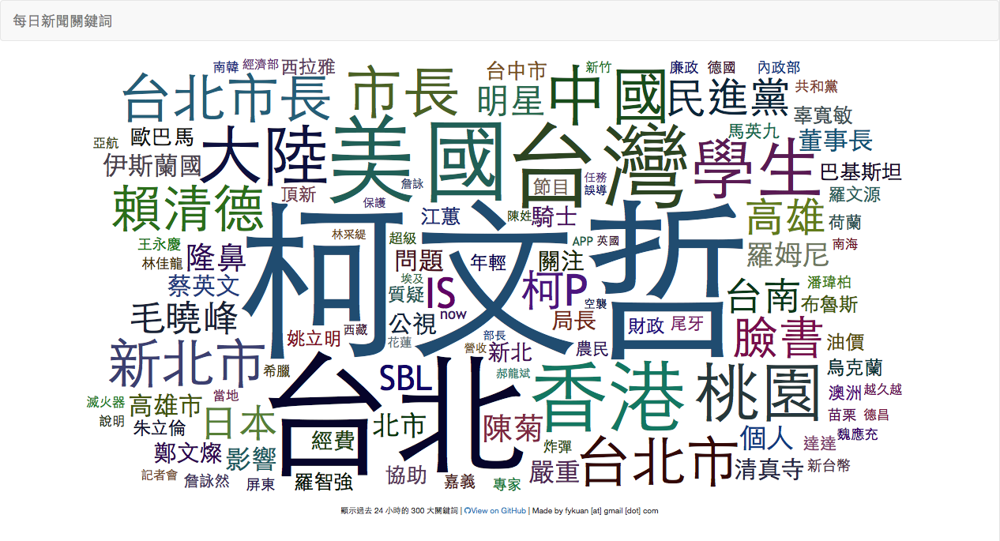

# 每日新聞關鍵字

## 簡介

顯示 24 小時內最熱門的關鍵詞。點選關鍵詞可以顯示該關鍵詞一週趨勢圖

## Dependency
* [jieba](https://github.com/fxsjy/jieba) 斷詞引擎
* [wordcloud2.js](https://github.com/timdream/wordcloud2.js) 顯示關鍵詞雲
* [bPopop](https://github.com/dinbror/bpopup/) 彈出 HTML div
* [HighCharts](http://www.highcharts.com/)

## DEMO
[每日新聞關鍵字](http://keywordapp.launchzone.org/)